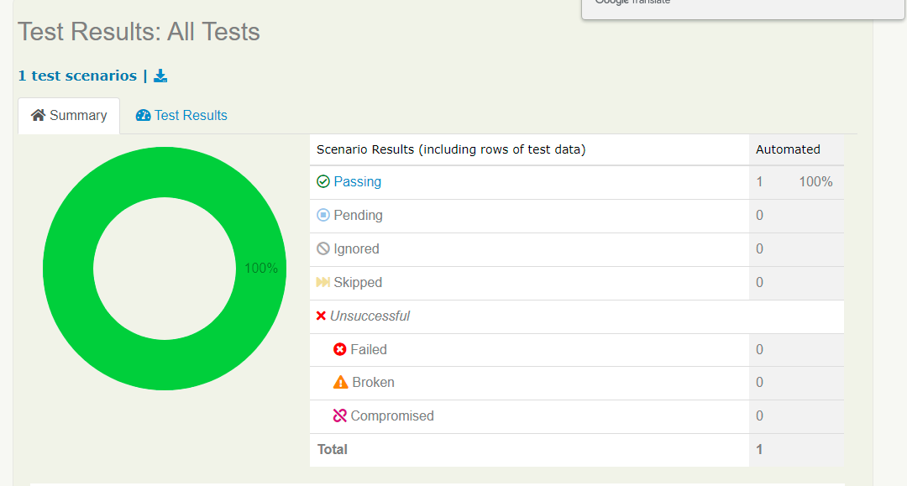

# RetoBanitsmo

proyecto reto para ingreso a banitsmo desarollo mediante framework de screenplay mapeo de objetos de la interfaz

## comandos para utilizar el proyecto

#### comandos git
> git clone https://github.com/pattyvillaj/RetoBanitsmo.git

> git status -s

> git add .

> git commit -m "reto banitsmo"

> git push origin main

#### ejecutar el proyecto
> gradle clean test

### paso a paso desarrollo de la prueba
reporte generado

